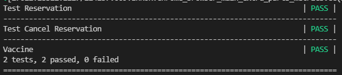

# vaccine-web-tests
E2E test for https://vaccine-haven.herokuapp.com/
## Installation
### Required [ChromeDriver](https://sites.google.com/chromium.org/driver/)
### 1. Clone Project
```
git clone https://github.com/sujinunt/vaccine-web-tests.git
```
### 2. Install the required module
#### Upgrade pip to the lastest version
```
python -m pip install --upgrade pip
```
#### Installing Robot Framework with pip
```
pip install robotframework
```
#### Install SeleniumLibrary
```
pip install robotframework-seleniumlibrary
```
### 3. Running
```
robot vaccine.robot
```

**If test fail please try again.**
## Question
Which do you think is a better framework for E2E testing of web applications or web services:  Robot Framework or Cucumber with Selenium/HTTP library and JUnit?

**Answer**
In my opinion, Robot Framework look easy to use more than Cucumber because Cucumber look more complex than Robot Framework. With Cucumber we need to have java file back cucumber but Robot Framework is not and easy to understand how E2E test work like go to url, click button and input value.

## Resource
[ROBOT FRAMEWORK GETTING STARTED](https://robotframework.org/?tab=1#getting-started)

[Robot Framework with SeleniumLibrary (Thai)](https://iamgique.medium.com/%E0%B8%A1%E0%B8%B2%E0%B9%80%E0%B8%A3%E0%B8%B4%E0%B9%88%E0%B8%A1%E0%B8%95%E0%B9%89%E0%B8%99%E0%B9%80%E0%B8%82%E0%B8%B5%E0%B8%A2%E0%B8%99-automate-robot-framework-with-selenium2library-%E0%B9%81%E0%B8%A5%E0%B8%B0-%E0%B8%97%E0%B8%B3-workshop-login-facebook-cbcbbcc6abf8)
